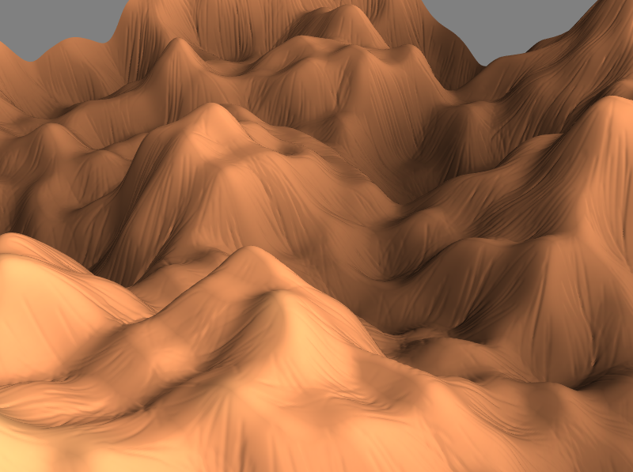

# World Weathering

Simulation of weathering on procedurally generated terrains

## World building

world-weathering uses Perlin noise to procedurally generate the worlds which are 2-d heightmaps

  
   
  <em> Full 1000x1000 height map generated with Perlin noise and displayed with Mayavi. </em>

## Erosion

  
  
   
  <em> Typical result from simulated hydraulic erosion. Left is before, right is after. </em>

## Acknowledgments
